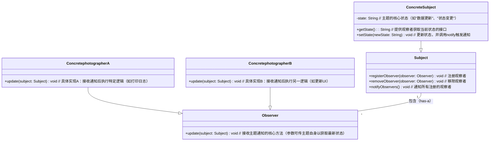

**观察者模式**和**发布-订阅者模式**总是让人傻傻分不清。

---

## 观察者模式



我们把被施加观察动作的角色称为**主题（Subject）**，把主动施加观察动作的角色称为**观察者（Observer）**。一个主题可以被多个观察者观察，观察者的行为是由主题的变化或动作触发的。

想象一下，在漫展上一群~~老色批~~架着摄影机围着一位角色扮演者（cosplayer），当 cosplayer 每变换一个姿势，那群~~老色批~~就纷纷按下快门键进行拍照。

```javascript
class Photographer {
  constructor(name) {
    this.name = name;
  }

  capture() {
    console.log(`📷 ${this.name}拍到了！`);
  }
}

class Cosplayer {
  constructor(name) {
    this.observers = [];
    this.name = name;
  }

  move() {
    console.log(`💃🏻 ${this.name}换姿势！`);
    this.notify();
  }

  notify() {
    let index = this.observers.length - 1;
    while(-1 !== index) {
      const observer = this.observers[index];
      observer.capture();
      index -= 1;
    }
  }

  registerObserver(observer) {
    this.observers.push(observer);
  }

  removeObserver(observer) {
    this.observers = this.observers.filter((item) => item !== observer);
  }
}

const coser = new Cosplayer('柳如烟');
const photographerA = new Photographer('摄影甲');
const photographerB = new Photographer('摄影乙');
coser.registerObserver(photographerA);
coser.registerObserver(photographerB);
coser.move();
coser.removeObserver(photographerA);
coser.move();
```

这个场景中摄影者就是观察者，角色扮演者就是主题，角色扮演者换一个姿势就是做出了变化，摄影者按下快门就是观察到角色扮演者姿势的变化而做出的行为。

## 发布-订阅者模式

发布-订阅者模式的核心价值是**解耦**。在聊发布-订阅者模式前我们先来看看什么是耦合，我们接着看上述观察者模式的举例：

```javascript
class Cosplayer {
  // ...
  notify() {
    let index = this.observers.length - 1;
    while(-1 !== index) {
      const observer = this.observers[index];
      observer.capture(); // 这里 capture 方法是 Photographer 特有的
      index -= 1;
    }
  }
  // ...
}
```

你看，在 `Cosplayer` 的 `notify()` 中，我们调用了 `observer.capture()` ，如果观察者不存在 `capture` 方法，那么这个程序就无法正常运行了。在这个观察者模式示例中主题和观察者是**强耦合**的。聪明的你可能想到了，那我让所有的观察者都有一个固定的方法，主题直接调用这个方法不就将主题和观察者进行解耦了吗！你真是太聪明了，你把**强耦合**变成了**弱耦合**。

```javascript
class Observer {
  constructor() {}

  update() {
    throw new Error('需要重写 update 方法。');
  }
}

class Photographer extends Observer {
  constructor(name) {
    super();
    this.name = name;
  }

  capture() {
    console.log(`📷 ${this.name}拍到了！`);
  }

  update() {
    this.capture();
  }
}

class Cosplayer {
  constructor(name) {
    this.observers = [];
    this.name = name;
  }

  move() {
    console.log(`💃🏻 ${this.name}换姿势！`);
    this.notify();
  }

  notify() {
    let index = this.observers.length - 1;
    while(-1 !== index) {
      const observer = this.observers[index];
      observer.update();
      index -= 1;
    }
  }

  registerObserver(observer) {
    this.observers.push(observer);
  }

  removeObserver(observer) {
    this.observers = this.observers.filter((item) => item !== observer);
  }
}

const coser = new Cosplayer('柳如烟');
const photographerA = new Photographer('摄影甲');
const photographerB = new Photographer('摄影乙');
coser.registerObserver(photographerA);
coser.registerObserver(photographerB);
coser.move();
coser.removeObserver(photographerA);
coser.move();
```

我们还可以进一步抽象一下，将主题的 `observers()` 、`registerObserver()`、`removeObserver()` 还有 `notify()` 抽离出去。

```javascript
class Observer {
  constructor() {}

  update() {
    throw new Error('需要重写 update 方法。');
  }
}

class Photographer extends Observer {
  constructor(name) {
    super();
    this.name = name;
  }
  
  capture() {
    console.log(`📷 ${this.name}拍到了！`);
  }
  
  update() {
    this.capture();
  }
}

class Subject {
	observers = [];
  
  constructor() {}

  notify() {
    let index = this.observers.length - 1;
    while(-1 !== index) {
      const observer = this.observers[index];
      observer.update();
      index -= 1;
    }
  }

  registerObserver(observer) {
    this.observers.push(observer);
  }

  removeObserver(observer) {
    this.observers = this.observers.filter((item) => item !== observer);
  }
}

class Cosplayer extends Subject {
  name = '角色扮演者';
  
  constructor(name) {
    super();
    this.name = name;
  }
  
  move() {
    console.log(`💃🏻 ${this.name}换姿势！`);
    this.notify();
  }
}

const coser = new Cosplayer('柳如烟');
const photographerA = new Photographer('摄影甲');
const photographerB = new Photographer('摄影乙');
coser.registerObserver(photographerA);
coser.registerObserver(photographerB);
coser.move();
coser.removeObserver(photographerA);
coser.move();
```

这个时候我们再回过头来看看观察者模式章节开头的类图，是不是很清楚呢？

虽然我们对代码做了一些抽象和解耦。但是我们其实还是可以发现观察者模式对一些场景没办法很好的支持。如当 Coser 和摄影师的行为变得复杂的时候：假设 Coser 离场后摄影师也会离场，当然，也有的摄影师可能会选择在 Cosper 离场后留在原地整理相册。这个时候，发布-订阅者模式就该出场了。

发布-订阅者模式在主题和观察者之间增加了**事件中心**，专门用来处理事件的监听和触发事件。这个时候主题就是事件的**发布者**，观察者就成了事件的**订阅者**。

```javascript
class EventBus {
  constructor() {
    this.listeners = new Map();
  }

  on(eventName, callback) {
    if (typeof callback !== 'function') throw new Error('Callback must be function.');
    const handlers = this.listeners.get(eventName);
    if (handlers) {
      handlers.push(callback);
    } else {
      this.listeners.set(eventName, [callback]);
    }
  }

  off(eventName, callback) {
    const handlers = this.listeners.get(eventName);
    if (handlers) {
	    handlers.splice(handlers.indexOf(callback), 1); 
    }
  }

  emit(eventName, ...args) {
    const handlers = this.listeners.get(eventName);
    if (handlers) {
      handlers.slice().forEach((handler) => handler(...args));
    }
  }
}

class Photographer {
  constructor(name) {
    this.name = name;
  }

  capture(coser) {
    console.log(`📷 ${this.name}拍到了${coser}！`);
  }

  leave() {
    console.log(`🏃 ${this.name}离开了！`);
  }
}

class Cosplayer {
  constructor(name) {
    this.name = name;
  }

  move(eventBus) {
    console.log(`💃🏻 ${this.name}换姿势！`);
    eventBus.emit('coser.move', this.name);
  }

  leave(eventBus) {
    console.log(`🍃 ${this.name}离开了！`);
    eventBus.emit('coser.leave', this.name);
  }
}

const eventBus = new EventBus();
const coser = new Cosplayer('柳如烟');
const photographerA = new Photographer('摄影甲');
const photographerB = new Photographer('摄影乙');

const photographerACapture = photographerA.capture.bind(photographerA);
const photographerBCapture = photographerB.capture.bind(photographerB);
const photographerALeave = photographerA.leave.bind(photographerA);
const photographerBLeave = photographerB.leave.bind(photographerB);

eventBus.on('coser.move', photographerACapture);
eventBus.on('coser.move', photographerBCapture);
eventBus.on('coser.leave', photographerALeave);
eventBus.on('coser.leave', photographerBLeave);
coser.move(eventBus);
photographerA.leave();
eventBus.off('coser.move', photographerACapture);
eventBus.off('coser.leave', photographerALeave);
coser.move(eventBus);
coser.leave(eventBus);
```

在发布-订阅者模式里，发布者不需要关心谁订阅了事件，不同的订阅者也可以决定订阅哪些事件以及监听到事件触发后做出何种行为。正如在这个示例中，Cosper 根本不知道谁在对她进行拍摄，她只管做出动作即可，摄影甲的离开与否她并不关心；同样，摄影甲和摄影乙也完全可以决定自己的行为，摄影甲可能中途就离开，摄影乙也可以自己抉择是否在 Coser 离开后跟着离开。

## 总结

发布-订阅者模式是观察者模式的递进而不是替代，需要根据业务场景的复杂性决定使用哪一种设计模式。
