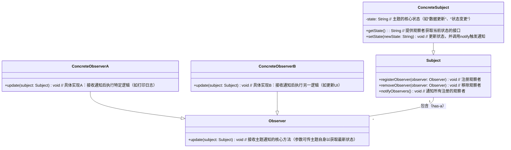

# 观察者模式 VS. 发布-订阅者模式

**观察者模式**和**发布-订阅者模式**总是让人傻傻分不清。

## 观察者模式



我们把被施加观察动作的角色称为**主题（Subject）**，把主动施加观察动作的角色称为**观察者（Observer）**。一个主题可以被多个观察者观察，观察者的行为是由主题的变化或动作触发的。

想象一下，在漫展上一群~~老色批~~架着摄影机围着一位角色扮演者（cosplayer），当 cosplayer 每变换一个姿势，那群~~老色批~~就纷纷按下快门键进行拍照。这个场景中摄影者就是观察者，角色扮演者就是主题，角色扮演者换一个姿势就是做出了变化，摄影者按下快门就是观察到角色扮演者姿势的变化而做出的行为。

```javascript
class Photographer {
  name = '摄影师';
  
  constructor(name) {
    this.name = name;
  }
  
  capture() {
    console.log(`📷 ${this.name}拍到了！`);
  }
}

class Cosplayer {
  name = '角色扮演者';
  
  observers = [];
  
  constructor(name) {
    this.name = name;
  }
  
  move() {
    console.log(`💃🏻 ${this.name}换姿势！`);
    this.notify();
  }
  
  notify() {
    let index = this.observers.length - 1;
    while(-1 !== index) {
      const observer = this.observers[index];
      observer.capture();
      index -= 1;
    }
  }
  
  registerObserver(observer) {
    this.observers.push(observer);
  }
  
  removeObserver(observer) {
    this.observers = this.observers.filter((item) => item !== observer);
  }
}

const coser = new Cosplayer('柳如烟');
const observerA = new Photographer('摄影甲');
const observerB = new Photographer('摄影乙');
coser.registerObserver(observerA);
coser.registerObserver(observerB);
coser.move();
coser.removeObserver(observerA);
coser.move();
```

## 发布-订阅者模式


## 从名字上看区别

从名字上看“发布-订阅者模式”比“观察者”模式要多一类角色，发布者和订阅者是两类角色，观察者是一类角色。
