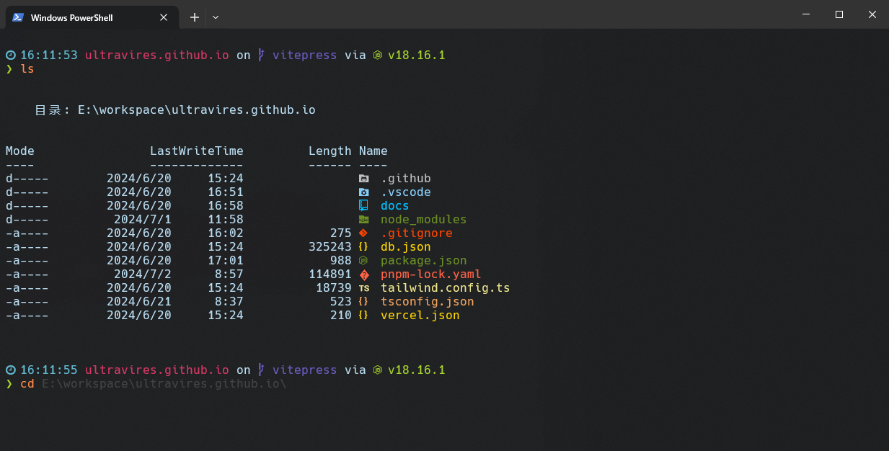

个人喜欢使用终端命令行，但默认的终端有点过于枯燥且不美观。

---



安装

- [oh-my-posh](https://ohmyposh.dev/) 用于美化终端
- [starship](https://starship.rs/) 用于美化终端
- [PSReadLine](https://github.com/PowerShell/PSReadLine) 用于终端输入提示
- [posh-git](https://github.com/dahlbyk/posh-git) 用于获取当前项目的 git 信息
- [clink](https://github.com/chrisant996/clink) 用于 CMD 终端
- [Terminal-Icons](https://github.com/devblackops/Terminal-Icons) 用于终端文件图标

::: tip 注意
`oh-my-posh` 和 `starship` 是不同的终端美化工具，两者只需选择一个，当然你也可以都安装，后期通过配置灵活切换。我这里选择的是 `starship`。
:::

`Nerd Font` 字体下载： [Nerd Fonts](https://www.nerdfonts.com/font-downloads)，推荐 `Hack Nerd Font` 字体。

`Windows Terminal` 主题下载： [Windows Terminal Themes](https://windowsterminalthemes.dev/)，我这里使用的主题是 `Flatland`，但修改了 `"brightBlack": "#686865"`。

```json
{
  "background": "#1D1F21",
  "black": "#1D1D19",
  "blue": "#5096BE",
  "brightBlack": "#686865",
  "brightBlue": "#61B9D0",
  "brightCyan": "#D63865",
  "brightGreen": "#A7D42C",
  "brightPurple": "#695ABC",
  "brightRed": "#D22A24",
  "brightWhite": "#FFFFFF",
  "brightYellow": "#FF8949",
  "cursorColor": "#708284",
  "cyan": "#D63865",
  "foreground": "#B8DBEF",
  "green": "#9FD364",
  "name": "Flatland",
  "purple": "#695ABC",
  "red": "#F18339",
  "selectionBackground": "#2B2A24",
  "white": "#FFFFFF",
  "yellow": "#F4EF6D"
}
```

编辑 `PowerShell` 配置文件：

```sh
notepad $PROFILE # 或者使用你喜欢的编辑器 `code $PROFILE`
```

```sh
# oh-my-posh3 设置主题
#Set-PoshPrompt -Theme negligible

# 导入 Terminal-Icons 模块
Import-Module -Name Terminal-Icons

# 设置预测文本来源为历史记录
Set-PSReadLineOption -PredictionSource History

# 设置 Tab 键补全
Set-PSReadlineKeyHandler -Key Tab -Function Complete
# 设置 Ctrl+d 为菜单补全和 Intellisense
Set-PSReadLineKeyHandler -Key "Ctrl+d" -Function MenuComplete
# 设置 Ctrl+z 为撤销
Set-PSReadLineKeyHandler -Key "Ctrl+z" -Function Undo
# 设置向上键为后向搜索历史记录
Set-PSReadLineKeyHandler -Key UpArrow -Function HistorySearchBackward
# 设置向下键为前向搜索历史纪录
Set-PSReadLineKeyHandler -Key DownArrow -Function HistorySearchForward
```

`starship.toml` 配置：

```toml
# 根据 schema 提供自动补全
"$schema" = 'https://starship.rs/config-schema.json'

# 在提示符之间插入空行
add_newline = true

format = '''$time$all'''

right_format = '''$battery'''

# 替换提示符
[character]
success_symbol = '[❯](bold green)'
error_symbol = '[❯](bold red)'

[battery]
full_symbol = '[  ](bold green)'
charging_symbol = '[  ](bold green)'
discharging_symbol = '[  ](bold yellow)'

# 电池电量低于 10%
[[battery.display]]
threshold = 10
style = 'bold red'

# 电池电量低于 30%
[[battery.display]]
threshold = 30
style = 'bold yellow'

# 电池电量低于 100%
# [[battery.display]]
# threshold = 100
# style = 'bold green'

# 时间组件展示
[time]
disabled = false
format = '[ $time ](bold blue)'

# 禁用 'package' 组件，将其隐藏
[package]
disabled = true

```

## Mac 终端美化

macOS 用户可以使用 **iTerm2** + **starship** + **eza** 的组合来打造一个高效美观的终端环境。

### iTerm2

[iTerm2](https://iterm2.com/) 是 macOS 上最强大的终端模拟器，相比系统自带终端，它提供了分屏、热键窗口、全局搜索、自动完成等实用功能。

```sh
brew install --cask iterm2
```

推荐配置：
- **主题**：`Preferences → Profiles → Colors → Color Presets`，推荐 `Solarized Dark` 或 `Snazzy`，你也可以从 [iTerm2-Color-Schemes](https://iterm2colorschemes.com/) 下载更多主题
- **字体**：`Preferences → Profiles → Text → Font`，选择已安装的 `Hack Nerd Font`
- **透明度**：`Preferences → Profiles → Window → Transparency`，适当设置背景模糊与透明度

### 安装 starship

```sh
brew install starship
```

在 `~/.zshrc` 末尾添加：

```sh
eval "$(starship init zsh)"
```

`starship` 配置文件位于 `~/.config/starship.toml`，上文中 starship 的配置完全通用，直接复用即可：
- 自定义提示符符号 `❯`
- 时间组件展示
- 电池电量显示

### eza

[eza](https://github.com/eza-community/eza) 是 `ls` 的现代替代品，使用 Rust 编写。相比原生 `ls`，它支持彩色输出、文件类型图标、Git 状态标识和树形目录展示，并且默认启用了人性化的文件大小显示。

```sh
brew install eza
```

在 `~/.zshrc` 中添加常用别名：

```sh
# eza 替代 ls
alias ls='eza --icons --group-directories-first'
alias ll='eza -l --icons --group-directories-first --git'
alias la='eza -la --icons --group-directories-first --git'
alias lt='eza -T --icons --group-directories-first'
alias tree='eza -T --icons'
```

常用参数说明：

| 参数 | 含义 |
|------|------|
| `--icons` | 展示文件类型图标 |
| `-l` | 详细列表模式 |
| `--git` | 显示 Git 仓库状态 |
| `-T` | 树形展示目录结构 |
| `--group-directories-first` | 目录排在文件前面 |

### Nerd Font 安装

macOS 上推荐使用 Homebrew 安装 Nerd Font，无需手动下载：

```sh
brew install --cask font-hack-nerd-font
```

安装后在 iTerm2 的字体设置中选择 `Hack Nerd Font` 即可。

### 最终效果

配置完成后，执行 `source ~/.zshrc` 使配置生效。你将获得一个带有文件图标、Git 状态、自定义提示符的高颜值终端。

---

### Windows 终端小结

以上配置设置完你应该能得到一个十分美观的 `Windows Terminal`，但你可能还需要进行如下配置：

- 设置 PowerShell 执行策略: [Set-ExecutionpPolicy](https://learn.microsoft.com/zh-cn/powershell/module/microsoft.powershell.security/set-executionpolicy)


## PowerShell 终端加载慢

管理员方式运行：

```ps
$env:PATH = [Runtime.InteropServices.RuntimeEnvironment]::GetRuntimeDirectory()
[AppDomain]::CurrentDomain.GetAssemblies() | ForEach-Object {
    $path = $_.Location
    if ($path) { 
        $name = Split-Path $path -Leaf
        Write-Host -ForegroundColor Yellow "`r`nRunning ngen.exe on '$name'"
        ngen.exe install $path /nologo
    }
}
```
